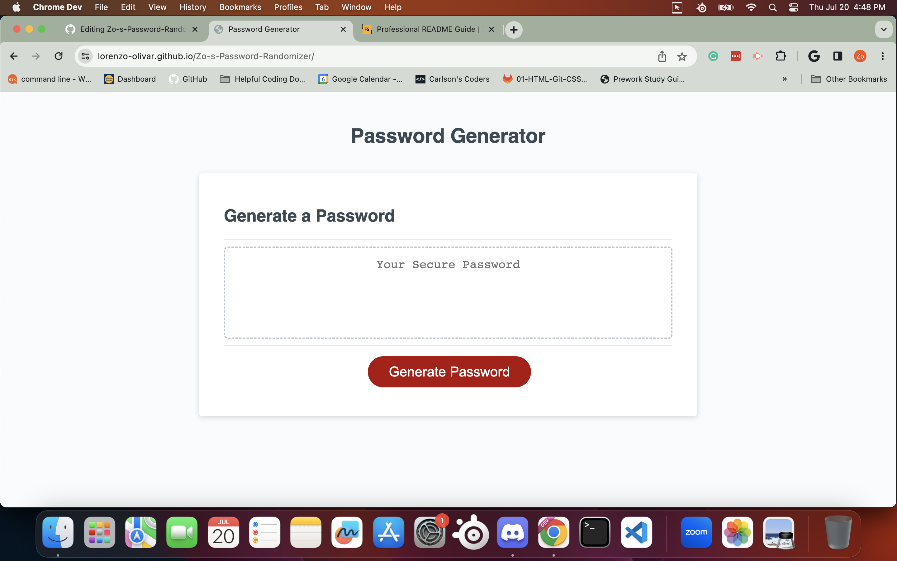
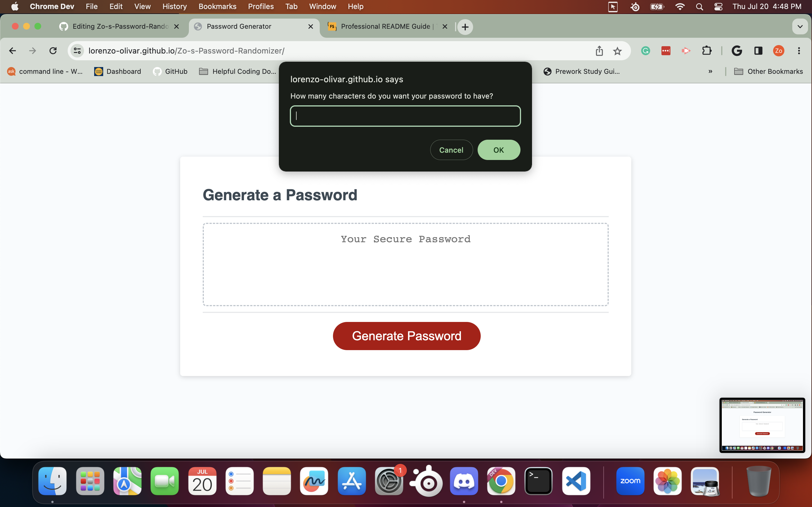
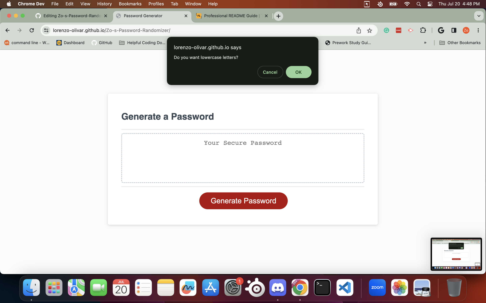
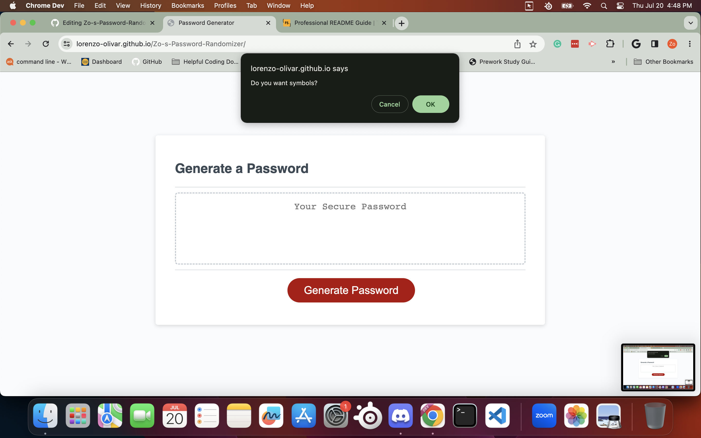

# Zo-s-Password-Randomizer

## Description

AS A developer,

I WANTED to code a password generator that has the option of choosing parameters like uppercase/lowercase, numbers, and symbols,

SO THAT users can generate a random password to their liking.

## Installation

Proceed with this URL link: [Link to Website](https://lorenzo-olivar.github.io/Zo-s-Password-Randomizer/)

## Usage

From this page, press Generate Password.

 

 Then you type how long you want your password to be.

 

 For the following, confirm or deny which parameters you want in your password.

 

 

 

 

## License

MIT license 

---
